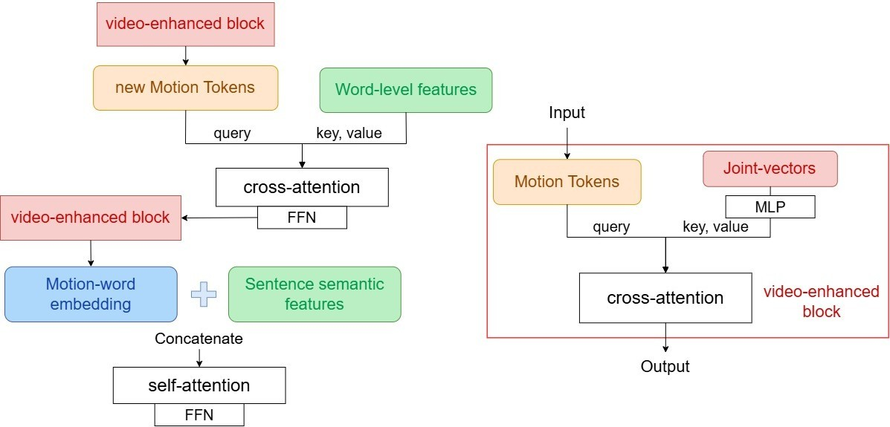

# Video-T2M

## Introduction

<p align="center">
We borrow the code from [AttT2M](https://github.com/ZcyMonkey/AttT2M/tree/main), you can check the orginal AttT2M architectur here.
We propose a video-enhanced blocks integrating an auxiliary joint features to augment the learning from ground truth. 

An overview on our framework is shown below.  
</p>
<p align="center">

</p>

<p align="center">
We design a simple video-enhanced blocks with MLP and Cross-Attention layer to encode the joint vectors into a simialr feature format with AttT2M's motion and text embedding, subsequently, insert this video-enhanced block before and after the semantic Cross-Attention layers respectively.  

We fine-tune our video-enhanced blocks and freeze all the other pre-trained parameters from AttT2M to accelerate the process and avoid undermining its performance. In addition, we don't revise the VQVAE encoder-decoder from AttT2M and use its pre-trained model directly.  
</p>

### Visualization
We add an additional video input into AttT2M's visualization code, and you can test it by following instruction.  
Install the environment:
```
pip install -r requirements.txt
```

Run the visualize script： 
```
python vis.py
```

Please make sure all the paths of imported files are correct in your local environment.  
You can adjust the temperature parameter α in vis.py to test the influence brought by our video-enhanced block.

## Dataset usage
<p align="center">
We use HumanML3D dataset, which inherits from AttT2M, to keep the consistency of training data. the details about them can be found [here](https://github.com/EricGuo5513/HumanML3D) or on the homapage of [AttT2M]. HumanML3D provides data generated from two datasets, KIT-ML and AMASS dataset. Since we only use the AMASS dataset for it possess the corresponding video animation, you can ignore the installation of KIT-ML dataset.  

Please note you have to generates the data following the instructions from HumanML3D dataset before you replicate the training process.  

</p>

## Code review

We provides the files we modified in our project, letting users quickly target our contribution.  

- dataset_TM_eval.py: enable it loading joint vectors data in Json format.
- dataset_TM_train.py: enable it loading joint vectors data in Json format.
- evaluator_wrapper.py: change the process of evaluation, adding an additional process on joint vectors.
- t2m_trans.py: The core architecture of our model. We add the video-enhanced blocks into the [CrossAttTransBase] class, keeping the same Cross-attention blocks from AttT2M and applying it in our video-enhanced design.
- train_t2m_trans.py: change the training process, adding an additional process on joint vectors, and we reduce the batch size due to the limitations of computational resource.
- vis.py: change the process of generating motion model or skeleton, adding an additional process on joint vectors and changing the testing prompts. The joint vectors used in visualization locate in eval_joints file.
- Yolo_test.py: We write the new python code to generate the joint vectors by Yolov8 before training or evaluation.  

